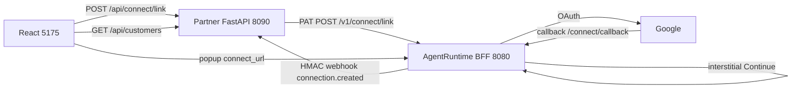

# Embedded Connect — reference demo (Acme SaaS)

Shareable **Tier A + Model B** proof: a minimal partner stack (FastAPI + React/Vite) that connects real Gmail accounts through AgentRuntime BFF using a PAT — no end-user AgentRuntime login.

This demo implements the **partner side** of [Embedded Connect](https://github.com/agentruntime-io/agentruntime-docs/blob/main/integrations/embedded-connect.md).

## What it proves

| Step | Who | What happens |
|------|-----|--------------|
| 1 | Partner React app | User clicks **Connect Gmail** |
| 2 | Partner FastAPI | `POST /api/connect/link` → proxies BFF `POST /v1/connect/link` |
| 3 | Partner React app | Opens **hosted connect URL on BFF** (`/connect/s/{session_id}`) — AgentRuntime **Google × AgentRuntime** interstitial |
| 4 | End user | Clicks **Continue to Google** → Google OAuth in same popup |
| 5 | BFF + Control | OAuth callback completes; principal-scoped connection stored in Vault |
| 6 | End user | Google consent (Model B if tenant BYO OAuth configured) |
| 7 | AgentRuntime | `connection.created` webhook (HMAC) to partner URL |
| 8 | Partner FastAPI | Verifies webhook → updates local customer row + inbox UI |

## Prerequisites

1. **AgentRuntime backends** running (BFF on `http://localhost:8080`, Control on `8002`) — localprod or your hosted stack.
2. **Migration `000034_embedded_connect`** applied to Control DB.
3. **Google connect enabled** on your workspace (platform or tenant Model B BYO OAuth).
4. **PAT** (server-side only) — Console → Settings → API keys:
   - **Embedded Connect (connect only)** — `mcp:read`, `mcp:write` — enough for this demo (`POST /v1/connect/link`, `PUT /v1/embedded-connect/settings`, webhooks).
   - **Embedded Connect** — adds `workflow:run`, `mcp:execute` when you also execute workflows per `external_user_id`.
5. **Google Cloud OAuth redirect URI** — add to your OAuth app (Model B) or platform app:

   ```text
   http://localhost:8080/connect/callback
   ```

6. Python 3.11+ and Node 20+.

## Quick start

Clone this repo, then run backend and frontend in separate terminals:

```powershell
git clone https://github.com/agentruntime-io/embedded-example.git
cd embedded-example
```

### 1. Backend

```powershell
cd backend
python -m venv .venv
.\.venv\Scripts\Activate.ps1
pip install -r requirements.txt
copy .env.example .env
# Edit .env — set AGENTRUNTIME_PAT
uvicorn main:app --reload --port 8090
```

### 2. Frontend

```powershell
cd frontend
npm install
npm run dev
```

Open **http://localhost:5175** — fake partner app **Acme SaaS**.

### 3. Try it

1. Confirm green banner: PAT + Google connect enabled.
2. Click **Connect Gmail** for Alice, Bob, or Carol.
3. Complete Google consent in the popup.
4. See **Webhook inbox** receive `connection.created` with `external_user_id` + `connection_id`.
5. Customer row shows connected Gmail + connection ID.

## Environment variables

| Variable | Description |
|----------|-------------|
| `AGENTRUNTIME_BFF_URL` | BFF base URL (default `http://localhost:8080`) |
| `AGENTRUNTIME_PAT` | Server-only PAT — **never** put in React; scopes `mcp:read` + `mcp:write` minimum |
| `DEMO_BACKEND_PUBLIC_URL` | Public URL for **webhook delivery** (`/api/webhooks/agentruntime`), not OAuth |
| `DEMO_WEBHOOK_SECRET` | HMAC secret registered via `PUT /v1/embedded-connect/settings` |
| `DEMO_FRONTEND_ORIGINS` | Allowed postMessage origins from BFF-hosted connect popup |

## Architecture (this repo)

```text
embedded-example/
  backend/          FastAPI — partner API (PAT calls + webhook receiver; no OAuth UI)
  frontend/         Vite React — partner UI (opens BFF popup; no PAT)
  examples/         Tenant Data schema + Gmail backfill workflow JSON
  README.md
```

**Partner vs AgentRuntime:** `cust_alice`, `cust_bob`, `cust_carol` live in partner SQLite for the demo UI. AgentRuntime creates matching principals and connections in Control; webhooks carry the canonical `principal_id` and `connection_id`.



## Gmail backfill (Tenant Data + workflow)

After users connect Gmail via Embedded Connect, run a **principal-scoped** workflow to search Gmail and insert rows into Tenant Data. Example artifacts live in [`examples/`](examples/).

| File | Purpose |
|------|---------|
| [`examples/tenant-data-schema.json`](examples/tenant-data-schema.json) | Tenant Data `emails` table (scoped by `external_id` + `gmail_id`) |
| [`examples/gmail-backfill-workflow.json`](examples/gmail-backfill-workflow.json) | Console workflow export — Gmail search → Lua map → `tenantdata_insert` |

### Setup

1. **Tenant Data** — Console → Data → create schema from JSON below (or import [`tenant-data-schema.json`](examples/tenant-data-schema.json)).
2. **Workflow** — Console → Workflows → import or recreate from [`gmail-backfill-workflow.json`](examples/gmail-backfill-workflow.json).
3. **Replace tenant-specific IDs** in the workflow before running in your workspace:
   - Gmail MCP `instance_id` on the search step
   - Tenant Data MCP `instance_id` on `tenantdata_insert`
4. **Run** per connected principal (manual, segment, or cron) with starting input, for example:

   ```json
   {
     "backfill_after": "2026/01/01",
     "backfill_before": "2026/02/01",
     "synced_at": "2026-02-01T12:00:00Z"
   }
   ```

   Run as **Principal** or **Segment** so Gmail uses each customer's connection. The Lua step reads **`run.external_id`** (your partner key, e.g. `cust_alice`) from run metadata — no need to duplicate it in starting input. Workspace runs omit `run.external_id`; this workflow is intended for embedded per-customer sync.

   Gmail step uses `connection_resolution: principal` and query `in:all after:{{input.backfill_after}} before:{{input.backfill_before}}`. The foreach body maps each message to an `emails` row (`on_duplicate: ignore` on composite key `external_id` + `gmail_id`). Set `for_each_max_parallel` lower (e.g. `5`) if you hit DB connection limits under segment fan-out.

### Tenant Data schema

```json
{
  "tables": [
    {
      "name": "emails",
      "columns": [
        { "name": "external_id", "type": "short_text", "required": true, "primary_key": true },
        { "name": "gmail_id", "type": "short_text", "required": true, "primary_key": true },
        { "name": "thread_id", "type": "short_text", "required": true },
        { "name": "subject", "type": "string" },
        { "name": "from_email", "type": "email" },
        { "name": "to_email", "type": "string" },
        { "name": "snippet", "type": "string" },
        { "name": "received_at", "type": "datetime" },
        { "name": "source", "type": "short_text", "required": true },
        { "name": "synced_at", "type": "datetime", "required": true }
      ],
      "display_name": "Emails",
      "on_duplicate": "ignore"
    }
  ]
}
```

### Reference workflow

<details>
<summary>Full workflow JSON (click to expand)</summary>

See [`examples/gmail-backfill-workflow.json`](examples/gmail-backfill-workflow.json) in this repo for the canonical copy. Summary of steps:

1. **MCP: gmail_search_emails** — `max_results: 100`, principal connection, date range from workflow input.
2. **For each (parallel)** — over `result.messages`, `for_each_max_parallel: 5`.
3. **Lua transform** — map Gmail headers to an `emails` row (`external_id` from `run.external_id`, `source: backfill`, ISO `received_at`).
4. **MCP: tenantdata_insert** — insert into table `emails`.

</details>

## Sharing with customers

1. Share the repo: **[github.com/agentruntime-io/embedded-example](https://github.com/agentruntime-io/embedded-example)** (or fork it for their org).
2. They clone, copy `backend/.env.example` → `backend/.env`, and add their PAT + Google redirect URI (see [Quick start](#quick-start)).
3. Walk through popup + webhook — mirrors production Tier A integration.
4. Optionally set up [Gmail backfill](#gmail-backfill-tenant-data--workflow) (Tenant Data schema + workflow).
5. Point them to [Embedded Connect product docs](https://github.com/agentruntime-io/agentruntime-docs/blob/main/integrations/embedded-connect.md).

## Troubleshooting

| Issue | Fix |
|-------|-----|
| `AGENTRUNTIME_PAT is not set` | Create `backend/.env` from `.env.example` |
| Google connect not enabled | Start BFF/control; configure Google acquisition in sysadmin or tenant BYO |
| OAuth redirect mismatch | Add `http://localhost:8080/connect/callback` to your tenant **Google OAuth application** (Settings → MCP → Google OAuth) in Google Cloud Console |
| 401/403 from BFF | PAT expired or missing connection scopes; recreate PAT |
| Same Gmail on two demo users merges | Use different Google accounts per demo customer, or enable separate grants in platform |

## License

Reference demo for AgentRuntime Embedded Connect — published at [embedded-example](https://github.com/agentruntime-io/embedded-example).
